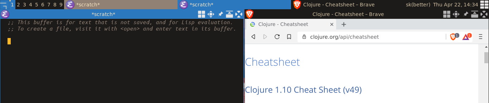

If you don't have a theme file, then copy the default theme 
into your Awesome configuration directory 
(this is usually *~/.config/awesome/*, generally it's where your **rc.lua** is located).
The defualt theme is [awesome-default-theme](https://awesomewm.org/doc/api/sample%20files/theme.lua.html).
Rename the copied file to **mytheme.lua**.
Paste the contents of **srcery_theme.lua** into the 
**mytheme.lua** file after the line:
```lua
  local theme = {}
```
comment out the old theme settings (-- means comment in lua):
```lua
-- theme.bg_normal     = "#222222"
-- theme.bg_focus      = "#535d6c"
-- theme.bg_urgent     = "#ff0000"
-- theme.bg_minimize   = "#444444"
-- theme.bg_systray    = theme.bg_normal
-- 
-- theme.fg_normal     = "#aaaaaa"
-- theme.fg_focus      = "#ffffff"
-- theme.fg_urgent     = "#ffffff"
-- theme.fg_minimize   = "#ffffff"
-- 
-- theme.useless_gap   = dpi(0)
-- theme.border_width  = dpi(1)
-- theme.border_normal = "#000000"
-- theme.border_focus  = "#535d6c"
-- theme.border_marked = "#91231c"
```
**don`t** comment out the font setting:
```lua
  theme.font = "your font"
```
If you have a default **rc.lua**, then replace the line:
```lua
  beautiful.init(gears.filesystem.get_themes_dir() .. "default/theme.lua")
```
with the line:
```lua
  beautiful.init(gears.filesystem.get_configuration_dir() .. "mytheme.lua")
```
if you don't have a default **rc.lua**, you probably know what to do to 
make sure Awesome loads the theme.
Finally reload Awesome (Ctrl + Modkey + R - by default).


