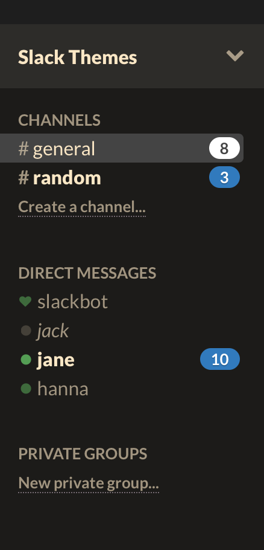

# Slack Srcery theme

To use this theme, go to Preferences → Sidebar and paste the following snippet
into the custom theme field.

`#1c1b19,#2D2C29,#444444,#FCE8C3,#2D2C29,#FCE8C3,#519F50,#2C78BF`

